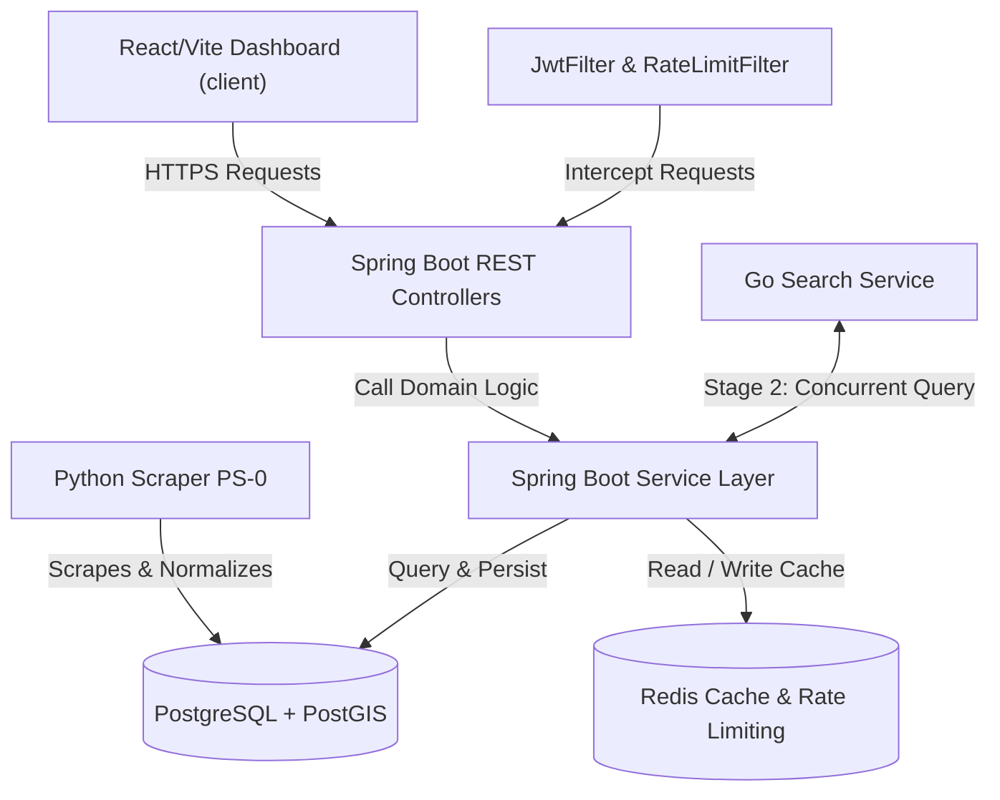

# Property Intelligence Platform

[](https://github.com/islajr/property-intel/actions)
[](api/target/site/jacoco/index.html)
[](https://opensource.org/licenses/MIT)

A real-time data intelligence and market analytics engine for the residential real-estate market in Nigeria. The platform structures, normalizes, and tracks property listings from multiple portals over time, providing APIs for listings, neighbourhood-level statistics, percentiles, and market trends.

> [!NOTE]
> This is a **data intelligence platform**, not a marketplace. It does not facilitate property transactions, host user listing uploads, or collect photographs. Instead, it serves as the analytics and valuation layer for Nigerian residential properties.

---

## Repository Structure

The platform is structured as a decoupled monorepo:

```text
property-intel/
├── api/             # Spring Boot REST API Backend Service
│   ├── src/         # Java source code
│   └── pom.xml      # Maven dependencies and build configuration
├── client/          # React / Vite Frontend Analytics Dashboard
│   ├── src/         # React, TypeScript, Leaflet maps, and Recharts charts
│   ├── CODEBASE.md  # Comprehensive guide detailing client internals
│   └── package.json # NPM dependencies and dev configurations
└── docs/            # Technical integration specifications
```

---

## High-Level System Architecture

The platform uses a decoupled microservice architecture:



### Core Components
1. **Python Data Pipeline (PS-0)**: Runs scheduled scraper processes against major Nigerian listing portals, geocodes addresses, and streams normalized properties into the database.
2. **Spring Boot Core API (api)**: Primary REST API engine built on **Java 21** and **Spring Boot 4.0.5** conforming to strict production boundaries (constructor injection, records for DTOs, and representing all prices as `BIGINT` in **kobo**).
3. **React Client Dashboard (client)**: Type-safe analytics application built on **React 18** and **Vite** featuring Leaflet georeferenced maps, Recharts trend statistics, and Zustand in-memory session stores.
4. **Redis Cache & Rate Limiting**: Utilizes Redis for high-performance query caching (composite SpEL key normalization with 6-hour TTL) and Bucket4j rate-limiting.
5. **PostgreSQL + PostGIS**: Datastore spatially indexed with PostGIS for geo-distance lookups (`ST_DWithin` / Haversine) and full-text index search engines (`tsvector`).

---

## Key Technical Features

- **JWT RS256 Authentication**: Stateless authentication using asymmetric key pairs with rotating refresh tokens stored in HttpOnly cookies.
- **Distributed Rate Limiting**: Tiered Bucket4j rate limiters (Auth, Public, Authenticated) integrated with Redis.
- **Idempotent Requests**: Request interception using custom hashing interceptors to block duplicate write requests.
- **Asynchronous Alerts**: Event-driven alert matcher that allows users to create search filters (neighbourhood, price, property type, bedrooms) and receive automated notifications.
- **Nearby Listing Search**: Radial coordinate search using spherical geo-distance (Haversine formula) to locate properties within a given radius.

---

## Verification & Local Testing

### Isolated Test Execution (Testcontainers)
To overcome database seeding challenges, the project enforces production test discipline using **Testcontainers**. You do **not** need a running PostgreSQL database or Redis instance on your machine to verify the code:

1. **Prerequisites**: Ensure you have [Docker](https://www.docker.com/) running locally.
2. **Running Tests**:
   Execute the following maven command in the `api` folder:
   ```bash
   ./mvnw clean test
   ```
   It will dynamically spin up isolated PostgreSQL and Redis containers, execute schema migrations, and verify backend API behaviors.

### Code Testing Coverage
Test coverage is tracked automatically via JaCoCo on every test execution. The latest aggregated results are:

| Metric | Coverage % |
| --- | --- |
| **Instruction Coverage** | 76.32% |
| **Line Coverage** | 74.47% |
| **Branch Coverage** | 58.54% |

---

## Integration & API Specifications

A complete reference guide is available in the dedicated documentation directories:

- **[Detailed Project Integration Guide](https://github.com/islajr/property-intel/blob/master/docs/project_documentation.md)**: Full database schema structure, Flyway scripts, and environment setups.
- **[Detailed Client Codebase Guide](https://github.com/islajr/property-intel/blob/master/client/CODEBASE.md)**: Frontend state maps, sequence data flows, and component specs.
