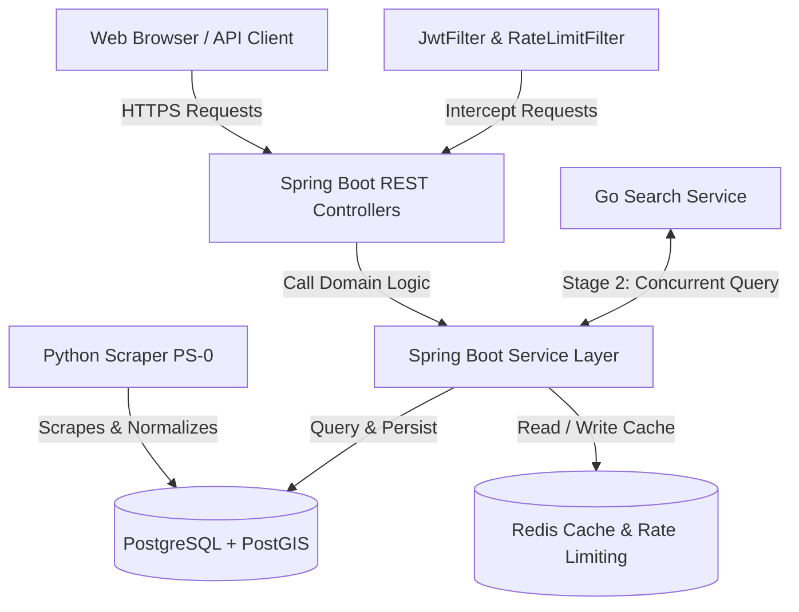

# Property Intelligence Platform

[](https://github.com/islajr/property-intel/actions)
[](https://opensource.org/licenses/MIT)

A real-time data intelligence and market analytics engine for the residential real-estate market in Nigeria. The platform structures, normalizes, and tracks property listings from multiple portals over time, providing APIs for listings, neighbourhood-level statistics, percentiles, and market trends.

> [!NOTE]
> This is a **data intelligence platform**, not a marketplace. It does not facilitate property transactions, host user listing uploads, or collect photographs. Instead, it serves as the analytics and valuation layer for residential properties.

---

## 🏗️ High-Level System Architecture

The platform uses a decoupled microservice architecture:



### Core Components
1. **Python Data Pipeline (PS-0)**: Runs scheduled scraper processes against major Nigerian listing portals, geocodes addresses, and streams normalized properties into the database.
2. **Spring Boot Core API**: Primary REST API engine built on **Java 21** and **Spring Boot 3.x** conforming to strict production boundaries (constructor injection, records for DTOs, and representing all prices as `BIGINT` in **kobo**).
3. **Redis Cache & Rate Limiting**: Utilizes Redis for high-performance query caching (composite SpEL key normalization with 6-hour TTL) and Bucket4j rate-limiting.
4. **PostgreSQL + PostGIS**: Datastore spatially indexed with PostGIS for geo-distance lookups (`ST_DWithin`) and full-text index search engines (`tsvector`).

---

## ⚡ Key Technical Features

- **JWT RS256 Authentication**: Stateless authentication using asymmetric key pairs with rotating refresh tokens stored in HttpOnly cookies.
- **Separation of Concerns**: Core service layers are fully decoupled from HTTP concepts (such as cookies or response objects), easing testing and modularity.
- **OpenAPI 3.0 / Swagger UI**: Autogenerated and fully documented API specs with dynamic error schemas.
- **Structured SLF4J logging**: Detailed contextual tracing with conditional stack trace output (suppressed for standard 4xx validation/client warnings, enabled for critical 5xx server exceptions).
- **Asynchronous Alerts**: Event-driven alert matcher that scans incoming listings and dispatches HTML email notifications via SMTP.

---

## 🧪 Verification & Local Testing

### The Scraper Dependency Quirk
The underlying data in this repository is gathered by **[PropertyScraper](https://github.com/islajr/property-scraper)** — an asynchronous python property scraper running against live Nigerian residential property portals. Because this pipeline depends on real-world active web scraping and geocoding resources, the data seed cannot easily be replicated locally.

### Isolated Test Execution (Testcontainers)
To overcome database seeding challenges, the project enforces production test discipline using **Testcontainers**. You do **not** need a running PostgreSQL database or Redis instance on your machine to verify the code:

1. **Prerequisites**: Ensure you have [Docker](https://www.docker.com/) running locally.
2. **Running Tests**:
   Execute the following maven command. It will dynamically spin up an isolated, real `postgis/postgis` PostgreSQL container and an alpine Redis container, execute the schema migrations, and verify the backend API behaviors:
   ```bash
   mvn clean test
   ```

---

## 📖 Integration & API Specifications

A complete reference guide, including database schemas, Flyway migrations, environment parameters, and detailed API specs for auth, listings, market trends, and geofencing, is available in the dedicated documentation directory:

👉 **[Detailed Project Integration Guide](https://github.com/islajr/property-intel/docs/project_documentation.md)**
