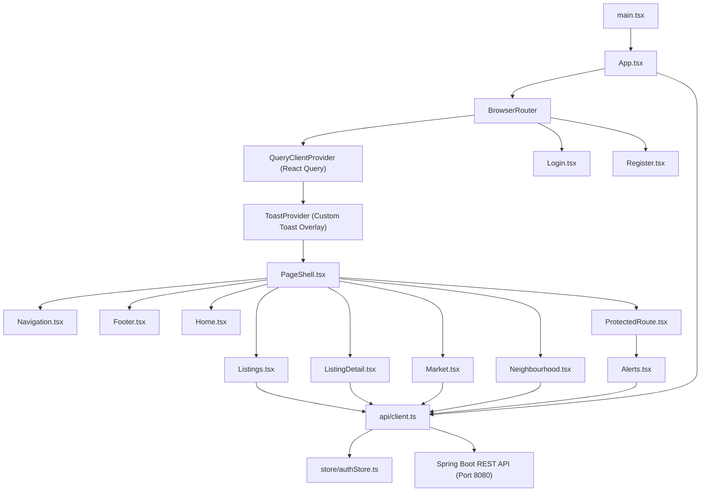
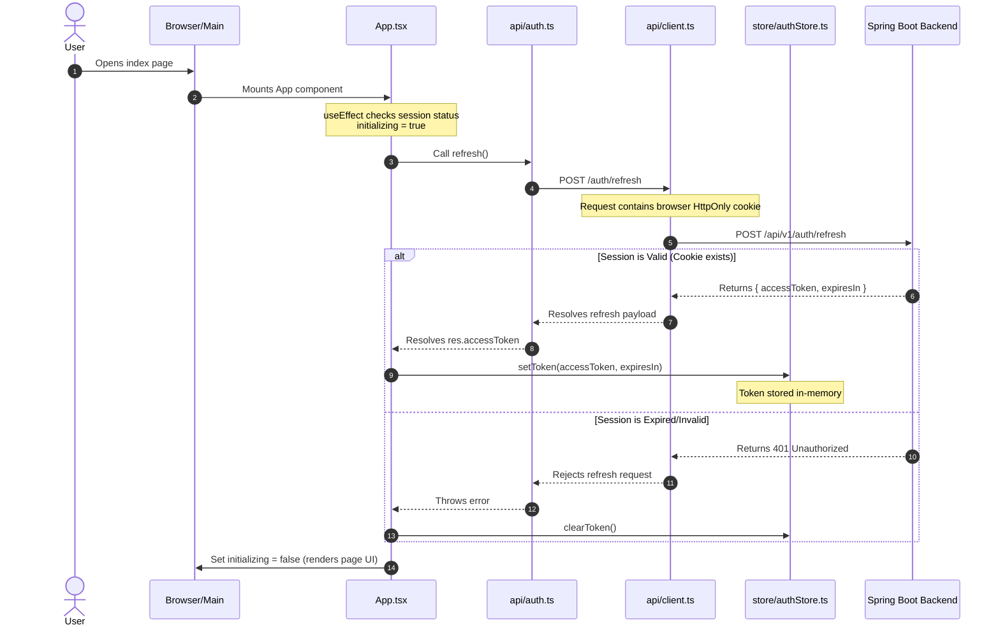
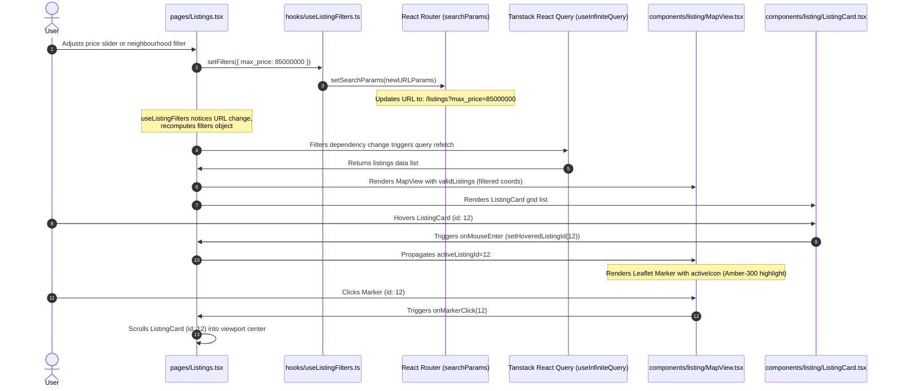

# Property Intelligence Platform — Frontend Client Codebase Guide

This document provides a comprehensive walkthrough of the Property Intelligence Platform frontend client (`/client`). It is designed for engineers and developers to understand the project architecture, state management, design systems, visual configurations, API integration layers, and components down to the implementation details.

---

## 1. Product Positioning & Constraints

Unlike general real estate listing portals or client-facing consumer apps, this platform functions as a **financial data terminal** for the Nigerian residential property market. The design and UX strictly adhere to several core principles:

- **No-Photograph Constraint**: Instead of photographs, layout structures rely entirely on rich, high-density data visualizations (trend charts, sparklines, price percentile bars) and clear status indicators (such as Days-on-Market traffic lights).
- **Lagos-Aware Data Density**: Typography, symbols, and groupings highlight Nigerian currency treatments (₦) and neighbourhood categorizations (Lekki Phase 1, Ajah, Victoria Island, Ikeja GRA, etc.).
- **Typography Pairing**: Pairs **Inter** (for UI structures and text) with **DM Mono** (for numerical statistics, dates, and prices). Monospace rendering ensures table columns align vertically and elements do not shift during updates.
- **Vanilla CSS styling**: The project utilizes custom HSL CSS properties inside a global stylesheet without relying on Tailwind CSS or utility layout frameworks.

---

## 2. Directory Layout & Architecture

The client directory is laid out as follows:

```text
client/
├── .env                    # Local environment config (VITE_API_BASE_URL)
├── .env.example            # Environment variables scaffold
├── package.json            # Tooling and scripts definitions
├── vite.config.ts          # Vite bundler and development proxy configurations
├── tsconfig.json           # Compiler targets and strict rules configuration
├── src/
│   ├── main.tsx            # Application mounting and bootstrap point
│   ├── App.tsx             # Root routing, query client initialization, silent refresh
│   ├── api/                # API client configuration and resource endpoints
│   │   ├── client.ts       # Axios instance with request/response interceptors
│   │   ├── auth.ts         # User logins, registrations, and refresh actions
│   │   ├── listings.ts     # Property listing queries, details, and nearby endpoints
│   │   ├── market.ts       # Neighbourhood metrics, aggregates, and listing flows
│   │   └── alerts.ts       # Saved query alerts and email subscription center
│   ├── store/              # Zustand memory credential stores
│   │   └── authStore.ts    # In-memory JWT access token store (anti-XSS vector)
│   ├── hooks/              # Custom React hooks
│   │   └── useListingFilters.ts # Synchronizes state filters with URL query parameters
│   ├── styles/             # Stylesheet configuration
│   │   └── globals.css     # Global custom CSS properties, resets, utility classes, and transitions
│   ├── types/              # Type definitions matching backend data contracts
│   │   └── api.d.ts        # Data structures for listings, metrics, and profiles
│   ├── utils/              # Utility helpers
│   │   └── format.ts       # Price formatting and Naira-Kobo conversions
│   ├── pages/              # Routed screen view compositions
│   │   ├── Home.tsx        # Search, market snapshots, trending areas, recent listings
│   │   ├── Listings.tsx    # Split listings grid and Leaflet map, filters panel
│   │   ├── ListingDetail.tsx # Listing metadata view, price histories, minimap preview
│   │   ├── Market.tsx      # Aggregate markets dashboard, summary metrics
│   │   ├── Neighbourhood.tsx # Neighbourhood pricing trend dashboard, percentile graphs
│   │   ├── Alerts.tsx      # User's active subscription criteria manager
│   │   ├── Login.tsx       # Auth card for logging in
│   │   ├── Register.tsx    # Auth card for registering
│   │   └── NotFound.tsx    # Responsive 404 handler with fallback action redirection
│   └── components/         # Reusable presentation and interaction components
│       ├── auth/           # Login wrappers and Protected Route gatekeepers
│       ├── layout/         # Shell headers, footers, drawers, and filter bars
│       ├── listing/        # Map clustering views, sparklines, listing cards, timelines
│       ├── market/         # Statistics tiles, price percentile curves, trend layouts
│       ├── primitives/     # Core inputs, buttons, select boxes, skeletons, badges
│       └── toast/          # Contextual notification manager overlays
```

---

## 3. Visual & Styling Maps (What connects to What)

The diagram below illustrates the high-level request routing, component inclusion, and data hydration mapping of the platform.



---

## 4. Step-by-Step Data Flow Pipelines

Understanding how visual actions translate to network executions is key to maintaining the platform. The four main functional pipelines are traced below:

### 4.1 Bootstrapping & Silent Session Refresh
This pipeline explains what happens when a user first accesses the application, ensuring session retention across page reloads without storing tokens on insecure storage.



---

### 4.2 Filtered Search & Map Synchronization
This pipeline trace details how query-based listings filtering and map synchronization behave.



---

### 4.3 Neighbourhood Market Analytics Hydration
Trace of how local dashboards load coordinates, median metrics, supply volumes, and percentile bars.
1. **Routing**: User enters `/market/Lekki%20Phase%201`. [Neighbourhood.tsx](file:///home/isla-jr/Documents/se-workspace/property-intel/client/src/pages/Neighbourhood.tsx) loads path parameter `:name`.
2. **Parallel Fetching**: Executes three concurrent Tanstack React Query fetches:
   - `market.getStats('Lekki Phase 1')` (P25/P75 percentiles, WoW price updates, lifetime values).
   - `market.getNeighbourhoods()` (finds target neighbourhood object containing active counts).
   - `listings.search({ neighbourhood: 'Lekki Phase 1', limit: 6 })` (pulls active listings locally).
3. **Distribution Curve rendering**: `PricePercentilesBar` receives `P25` and `P75` thresholds. It maps them relative to the `P10` and `P90` boundaries, rendering a visual bar while rendering the readable text underneath.
4. **Price Index Rendering**: Feeds historical stats arrays into Recharts `TrendChart` to plot the primary median price area overlay alongside secondary supply bars.

---

### 4.4 Search Alert Subscription Pipeline
Trace of the alert validation, Naira-Kobo conversion, and creation flow:
1. **Input validation**: User inputs details inside the alert builder form. The email frequency, area bounds, and target budget (Naira) are validated on blur.
2. **Kobo Factor Conversion**: In compliance with the database schema storing integers in Kobo currency, form submission triggers the conversion utility:
   ```typescript
   const maxPriceKobo = maxPriceNaira ? maxPriceNaira * 100 : null;
   ```
3. **Idempotency Assignment**: Generates a standard client-side v4 UUID and attaches it to the request header to prevent duplicate saves during network retries:
   ```typescript
   headers: { 'X-Idempotency-Key': uuidv4() }
   ```
4. **Creation POST Request**: Dispatches the payload to `/api/v1/auth/alerts` via Axios.
5. **Cache Invalidation**: On success, Tanstack Query invalidates `['alerts']` cache keys, forcing the active alerts grid list to refresh.

---

## 5. Component Interaction & State Mapping

The table below lists the relationships between parent components and child layout items.

| Parent Component | Child Component | State & Prop Callbacks | Purpose |
|---|---|---|---|
| **App.tsx** | `PageShell.tsx` | Routing Context | Wraps main navigation layouts. |
| **PageShell.tsx** | `Navigation.tsx` | In-memory token checks | Shows user's authenticated controls. |
| **Listings.tsx** | `FilterSidebar.tsx` | `filters` (State), `onApply` (Callback) | Passes current criteria parameters for updates. |
| **Listings.tsx** | `MapView.tsx` | `listings` (Prop), `hoveredListingId` (State) | Syncs map pins with hovered listings cards. |
| **Listings.tsx** | `ListingCard.tsx` | `listing` (Prop), `onClick` (Callback) | Displays property cards and handles details routing. |
| **ListingDetail.tsx**| `MapView.tsx` | `[listing]` (Prop), `center` (Prop) | Renders a non-interactive minimap centered on coordinates. |
| **ListingDetail.tsx**| `PriceHistoryTimeline.tsx` | `priceHistory` (Prop) | Renders vertical chronological listings events. |
| **Neighbourhood.tsx**| `TrendChart.tsx` | `trendData` (Prop) | Feeds historical arrays to construct Recharts graphs. |
| **Alerts.tsx** | `AlertForm.tsx` | `onSuccess` (Callback) | Triggers notifications and refetches active lists. |
| **Alerts.tsx** | `AlertCard.tsx` | `alert` (Prop), `onDelete` (Callback) | Handles three-second deletion triggers. |

---

## 6. Detailed Endpoint-to-Service Mapping

Below is the mapping of client visual components to their corresponding Spring Boot API endpoints.

| Page / Component | Client Service Function | API Endpoint | HTTP Method | Public / Private |
|---|---|---|---|---|
| **Home.tsx** (Snapshot) | `market.getStats('Ajah')` | `/api/v1/market/stats/Ajah` | `GET` | Public |
| **Home.tsx** (Trending) | `market.getNeighbourhoods()` | `/api/v1/market/neighbourhoods` | `GET` | Public |
| **Home.tsx** (Recent) | `listings.search()` | `/api/v1/listings` | `GET` | Public |
| **Listings.tsx** (Search) | `listings.search(params)` | `/api/v1/listings` | `GET` | Public |
| **ListingDetail.tsx** | `listings.getById(id)` | `/api/v1/listings/{id}` | `GET` | Public |
| **Neighbourhood.tsx** | `market.getStats(name)` | `/api/v1/market/stats/{name}` | `GET` | Public |
| **Alerts.tsx** (List) | `alerts.getAll()` | `/api/v1/auth/alerts` | `GET` | Private |
| **Alerts.tsx** (Create) | `alerts.create(payload)` | `/api/v1/auth/alerts` | `POST` | Private |
| **Alerts.tsx** (Delete) | `alerts.remove(id)` | `/api/v1/auth/alerts/{id}` | `DELETE` | Private |
| **Login.tsx** | `auth.login(credentials)` | `/api/v1/auth/login` | `POST` | Public |
| **Register.tsx** | `auth.register(profile)` | `/api/v1/auth/register` | `POST` | Public |
| **App.tsx** (Refresh) | `auth.refresh()` | `/api/v1/auth/refresh` | `POST` | Public (Cookie) |
| **Nav** (Logout) | `auth.logout()` | `/api/v1/auth/logout` | `POST` | Public |

---

## 7. Styling & Theming (`src/styles/globals.css`)

The visual design system is defined in [globals.css](file:///home/isla-jr/Documents/se-workspace/property-intel/client/src/styles/globals.css). It implements a flat-first, low-glare dark palette mimicking financial terminals.

### Core Variables & Accent Tokens
- **Backgrounds**: `--color-bg-base` (`#0C0F14`, deep ink), `--color-bg-raised` (`#13171F`, cards), `--color-bg-overlay` (`#1A202C`, modals).
- **Accent**: Lagos Amber (`var(--color-amber-400)` / `#F5B942`) is reserved for primary CTAs, active states, active navigation links, and focus outlines.
- **Market Signals**: Positive trends use emerald green (`--color-signal-up`), price drops and stale items use rose red (`--color-signal-down`).
- **Focus Indicator**: Standardized glow outline (`box-shadow: 0 0 0 3px var(--color-focus)`) applied to elements on keyboard tab navigation.

### Key Layout and Spacing System
Spacing is built on a base-4 grid system (from `--space-1` = 4px up to `--space-24` = 96px). Standard card paddings default to `--space-6` (24px) with inner gaps set to `--space-4` (16px).

### Utility Classes
To ensure design cohesion without utility frameworks, the bottom of [globals.css](file:///home/isla-jr/Documents/se-workspace/property-intel/client/src/styles/globals.css) houses a set of semantic utility classes:
- **Layouts & Flex**: `.flex`, `.flex-wrap`, `.justify-between`, `.items-center`, `.gap-1` to `.gap-4`, `.flex-1`.
- **Grids**: `.grid`, `.grid-cols-1` to `.grid-cols-3` layouts.
- **Styling**: `.bg-raised`, `.bg-subtle`, `.border`, `.border-default`, `.border-strong`, `.rounded-lg`, `.rounded-full`.
- **Text & Colors**: `.text-primary`, `.text-secondary`, `.text-tertiary`, `.text-amber`, `.font-bold`, `.font-semibold`, `.uppercase`, `.tracking-tight`, `.text-center`.

---

## 8. State Management Layer

State management is separated into server caching (React Query) and client credentials (Zustand).

### 8.1 In-Memory Zustand Store (`src/store/authStore.ts`)
To prevent XSS (Cross-Site Scripting) access token hijacking, the client maintains credential state strictly in-memory. Tokens are never persisted to `localStorage` or browser cookie storage.
- **State Properties**: `accessToken` (string | null), `expiresIn` (number | null).
- **Mutators**: `setToken(token, expires)` stores the access token; `clearToken()` purges authorization states.

### 8.2 React Query & API Cache Caching
Data updates, paginated listings, and search results are query-managed via `@tanstack/react-query` with a declarative, key-bound cache structure:
- Recent Listings key: `['listings', 'recent']`
- Filtered Listings key: `['listings', filters]`
- Neighbourhood Stats key: `['market', 'stats', name]`
- Alert Configurations key: `['alerts']`

---

## 9. UX, Accessibility, & Accessibility Standards

### 9.1 Key UX Guardrails
- **No Chatbots/Decorative Blobs**: Background animations and floating conversation avatars are blocked. Surfaces remain flat and typographic.
- **Safe Truncation**: Text overflows are managed with CSS ellipsis variables (`.truncate-ellipsis`) alongside standard title HTML attributes to reveal full names on hover.
- **Data Placeholders**: Empty or missing data points are represented using an em dash (`—`) styled in `--color-text-tertiary`, rather than defaulting to `0` or `N/A`.

### 9.2 Keyboard Navigation
- Interactive listing cards and stats cards carry active roles (`role="button"`) and standard indexing (`tabIndex={0}`).
- Pressing `Space` or `Enter` triggers navigation identical to mouse clicks.
- Interactive modal sheets (mobile drawers, filter panels) trap keyboard focus.

### 9.3 Screen Reader Compatibility
- All icon-only interactive controls (like the close icon button `X`) carry descriptive `aria-label` tags.
- Decorative labels are hidden from screen readers using `aria-hidden="true"`.
- Toast notifications are loaded inside polite status announcement wrappers (`aria-live="polite"`).

### 9.4 Reduced Motion Compatibility
To assist users with vestibular sensitivities, `globals.css` overrides transitions and animations when `prefers-reduced-motion: reduce` is active:
```css
@media (prefers-reduced-motion: reduce) {
  *, *::before, *::after {
    animation-duration: 0.01ms !important;
    transition-duration: 0.01ms !important;
  }
}
```

---

## 10. Local Configuration & Run Script

### Development Proxy (`vite.config.ts`)
To prevent browser CORS blocks during development, `vite.config.ts` proxies `/api` queries to the backend running on port 8080:
```typescript
server: {
  proxy: {
    '/api': {
      target: 'http://localhost:8080',
      changeOrigin: true,
      secure: false,
    },
  },
}
```

### Environment Configuration (`.env`)
- **VITE_API_BASE_URL**: Set to `/` in local development environments. This redirects API queries through the local Vite dev proxy. For production builds, it is set to the deployed backend domain.
