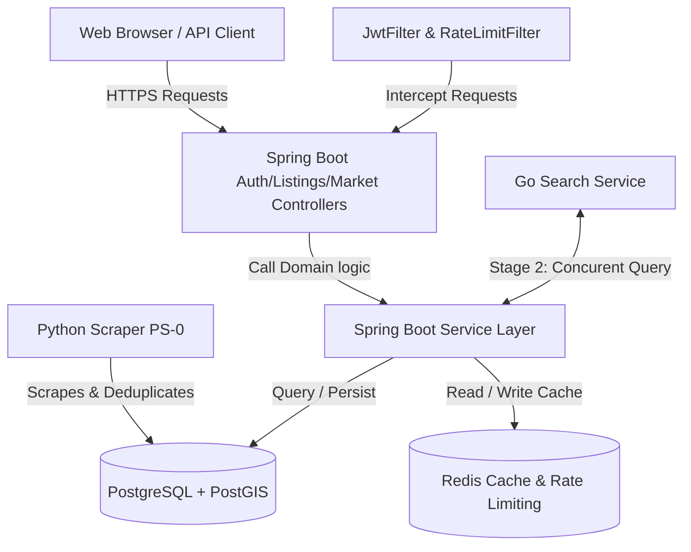

# Property Intelligence Platform Documentation

*Version 1.0 — June 2026*

Welcome to the **Property Intelligence Platform** documentation. This document serves as a complete reference guide for engineers, researchers, and administrators. It covers everything required to set up, understand, modify, and run the backend REST API engine in both local and production environments.

---

## Table of Contents
1. [Platform Identity & Objectives](#1-platform-identity--objectives)
2. [System Architecture](#2-system-architecture)
3. [Database Schema & Migrations](#3-database-schema--migrations)
4. [Core Features & Technical Implementation](#4-core-features--technical-implementation)
   - [Redis Caching & Key Normalization](#redis-caching--key-normalization)
   - [Separation of Concerns (Service vs. Controller)](#separation-of-concerns-service-vs-controller)
   - [Structured Logging & Stack Trace Suppression](#structured-logging--stack-trace-suppression)
   - [OpenAPI 3.0 / Swagger Documentation](#openapi-30--swagger-documentation)
5. [Local Setup & Developer Guide](#5-local-setup--developer-guide)
   - [Prerequisites](#prerequisites)
   - [Local Services (Docker Compose)](#local-services-docker-compose)
   - [Environment Variables](#environment-variables)
   - [Building & Testing](#building--testing)
6. [API Specification Reference](#6-api-specification-reference)

---

## 1. Platform Identity & Objectives

### What it is
The **Property Intelligence Platform** is a data intelligence platform that crawls, structures, tracks, and exposes real-time property market data and analytics for the Nigerian residential real-estate market. It is a data-driven service providing macro-level insights, neighbourhood statistics, price percentiles, and historical trends to agents, buyers, and financial analysts.

### What it is not
- It is **not** a property marketplace (no transaction support, no listing creation by users).
- It is **not** an agent hosting portal (does not compete with PropertyPro, Jiji, or Nigeria Property Centre).
- It is **not** a statutory valuation utility.
- It does **not** host or serve photographs.

---

## 2. System Architecture

The platform is designed around a decoupled, polyglot microservice layout.



### Core Architecture Components
1. **Python Scraper (PS-0)**: Runs scheduled crawls against major Nigerian property portals, normalizes data, computes geographic locations, and streams results into the PostgreSQL raw schema.
2. **Spring Boot API (Primary Engine)**: The primary REST API engine running on Java 21 and Spring Boot 3.x. Enforces strict backend coding guidelines:
   - **No field injection**: All dependencies are injected via constructor arguments (`@RequiredArgsConstructor` with `final` fields).
   - **DTO boundaries**: Database entity models never cross the controller boundary. All request inputs are validated DTOs, and all returns are API record classes.
   - **Kobo for money**: All property prices are represented as `BIGINT` (long) values in **kobo** (1 Naira = 100 kobo). Never use `double` or `float` for currencies to avoid floating-point errors.
3. **Redis Engine**: Manages caching and rate-limiting. Uses Lettuce driver and Lettuce-based ProxyManager for Bucket4j rate-limiting.
4. **PostgreSQL & PostGIS**: Hosts all data. Spatially enabled via PostGIS extension for geo-distance searches (`ST_DWithin`).
5. **OpenAPI / Swagger Engine**: Implements Springdoc OpenAPI 3.x UI, dynamically surfacing schemas and endpoints.

---

## 3. Database Schema & Migrations

All schema changes are defined inside Flyway SQL migration files under `src/main/resources/db/migration/`. No manual DDL is executed.

### Core Schemas
- `raw_data`: Hosts incoming listings from the scrapers and price event history.
- `market`: Hosts computed neighbourhood aggregate statistics and trend lines.
- `auth`: Hosts user security data, credentials, and session tokens.

### Table Relations Overview
- **`auths.users`**: Represents the platform account. Passwords are saved as BCrypt hashes.
- **`auths.refresh_tokens`**: Encapsulates rotating refresh tokens mapping back to users.
- **`raw_data.scraped_listings`**: The listing records containing portal metadata, price in kobo, coordinates, and full-text search vector (`search_vector`).
- **`raw_data.listing_history`**: Holds time-series price change events, listings, and removal tracks.
- **`market.neighbourhood_snapshots`**: Stores computed weekly statistics (median prices, active count, average days on market).

---

## 4. Core Features & Technical Implementation

### Redis Caching & Key Normalization
To reduce database load, market endpoints are aggressively cached using Redis with a default **6-hour TTL**. 

1. **Neighbourhood Details**: Cache name `CacheNames.MARKET_DETAILS`. Key is the neighbourhood name (e.g. `Ajah`).
2. **Neighbourhood Summary**: Cache name `CacheNames.MARKET_NEIGHBOURHOODS`. The query parameters `sortBy`, `limit`, and `cursor` form a normalized composite key:
   ```java
   key = "(#sortBy != null ? #sortBy : 'neighbourhood') + '_' + (#limit != null ? #limit : 20) + '_' + (#cursor != null ? #cursor : '')"
   ```
   This normalizes missing fields to defaults, preventing cache duplication and ensuring that equivalent search states resolve to the same cache entry.

### Separation of Concerns (Service vs. Controller)
The business layer (`AuthService.java`) is completely decoupled from Web-specific classes:
- It knows nothing about HTTP request cookies, headers, or `ResponseEntity`.
- It processes business transactions, raises exceptions for failures (such as `UnauthorizedException`), and returns a clean `AuthResult` DTO.
- The `AuthController` interceptor processes the `AuthResult`, builds HttpOnly cookies (handling secure flags, same-site attributes, and expiration), and returns the formatted response.

### Structured Logging & Stack Trace Suppression
Logging is implemented consistently across all services and controllers using Lombok's `@Slf4j` annotation:
- **Traces**: Logs query parameters on service entrances and matching count outputs on exits.
- **Null Safety**: `JwtLogoutHandler` safely checks the request cookies array, preventing `NullPointerException` crashes when cookies are absent.
- **Conditional Stack Traces**: 
  - To prevent mundane client errors (4xx series, such as `404 Not Found`, `401 Unauthorized`, and `400 Validation Failures`) from filling log files with long stack traces, `GlobalExceptionHandler.java` logs a concise single-line warning (`log.warn(...)` without the exception reference).
  - Unhandled server errors (5xx series) retain full stack traces (`log.error(..., ex)`) for troubleshooting.

### OpenAPI 3.0 / Swagger Documentation
API documentation is embedded directly into code using Swagger annotations. Every endpoint describes:
- Success shapes (`200 OK`) and validation requirements.
- Target request properties (`@Parameter`).
- Standard error structures referencing the unified `ErrorResponse` model.

---

## 5. Local Setup & Developer Guide

### Prerequisites
- **Java Development Kit (JDK)**: Version 21.
- **Docker & Docker Compose**: For running PostgreSQL + PostGIS and Redis locally.
- **Apache Maven**: For dependencies and compilation.

### Local Services (Docker Compose)
Create or check `docker-compose-dev.yml` in the project root:
```yaml
version: '3.9'
services:
  db:
    image: postgres:17
    environment:
      POSTGRES_USER: postgres
      POSTGRES_PASSWORD: "localpassword"
      POSTGRES_DB: empire-db
    ports:
      - "5433:5432"

  redis:
    image: redis:7-alpine
    ports:
      - "6379:6379"
```

### Environment Variables
Configure the following environment variables in your environment or IDE runner:

| Variable | Description | Example Value |
|---|---|---|
| `SPRING_DATASOURCE_URL` | JDBC Connection URL to PostgreSQL | `jdbc:postgresql://localhost:5433/empire-db` |
| `SPRING_DATASOURCE_USERNAME` | Database username | `postgres` |
| `SPRING_DATASOURCE_PASSWORD` | Database password | `localpassword` |
| `SPRING_CACHE_TYPE` | Cache backend provider | `redis` |
| `REDIS_URL` | Redis URL | `redis://localhost:6379` |
| `ACCESSTOKEN_EXPIRY_MILLISECONDS` | Access token lifespan in ms | `900000` (15 mins) |
| `ACCESSTOKEN_EXPIRY_SECONDS` | Access token lifespan in seconds | `900` |
| `REFRESHTOKEN_EXPIRY_SECONDS` | Refresh token lifespan in seconds | `604800` (7 days) |
| `RATELIMIT_PUBLIC_CAPACITY` | Max request capacity for public IP | `60` |
| `RATELIMIT_PUBLIC_REFILL_TOKENS` | Rate-limit refill count | `60` |
| `RATELIMIT_PUBLIC_REFILL_DURATION` | Rate-limit refill interval (minutes) | `1` |

### Building & Testing
Run compilation, check dependencies, and test database models:

1. **Compile**:
   ```bash
   mvn clean compile
   ```
2. **Execute Unit Tests**:
   ```bash
   mvn test -Dtest=AuthServiceTest,AuthControllerTest,MarketServiceTest,ListingServiceTest
   ```
3. **Run Locally**:
   ```bash
   mvn spring-boot:run
   ```
4. **Access Documentation**: Open your browser and navigate to `http://localhost:8080/swagger-ui.html` once the application is running.

---

## 6. API Specification Reference

### Authentication Endpoints

#### 1. Login
- **Route**: `POST /api/v1/auth/login`
- **Request Body (`LoginRequest`)**:
  ```json
  {
    "email": "user@example.com",
    "password": "SecretPassword123!"
  }
  ```
- **Responses**:
  - `200 OK`: Successful authentication. Sets a HttpOnly `refreshToken` cookie. Returns:
    ```json
    {
      "accessToken": "eyJhbGciOiJSUzI1Ni...",
      "expiresIn": 900
    }
    ```
  - `400 Bad Request`: Validation failure.
  - `401 Unauthorized`: Bad credentials.

#### 2. Register
- **Route**: `POST /api/v1/auth/register`
- **Request Body (`RegisterRequest`)**:
  ```json
  {
    "email": "newuser@example.com",
    "password": "SecretPassword123!"
  }
  ```
- **Responses**:
  - `200 OK`: Successful registration. Sets a HttpOnly `refreshToken` cookie. Returns:
    ```json
    {
      "accessToken": "eyJhbGciOiJSUzI1Ni...",
      "expiresIn": 900
    }
    ```
  - `400 Bad Request`: Validation failure or email already exists.

#### 3. Refresh Token
- **Route**: `POST /api/v1/auth/refresh`
- **Headers**: Expects HttpOnly `refreshToken` cookie.
- **Responses**:
  - `200 OK`: Rotates refresh token and returns a new access token. Sets a new HttpOnly cookie. Returns:
    ```json
    {
      "accessToken": "eyJhbGciOiJSUzI1Ni...",
      "expiresIn": 900
    }
    ```
  - `401 Unauthorized`: Missing or expired refresh token.

---

### Listings Endpoints

#### 1. Retrieve Paginated Listings
- **Route**: `GET /api/v1/listings`
- **Parameters (Query)**:
  - `neighbourhood` (string): e.g. `Ikoyi`
  - `type` (string): e.g. `FLAT_APARTMENT`
  - `min_price` (long): in kobo
  - `max_price` (long): in kobo
  - `cursor` (string): Pagination cursor from a previous response
  - `limit` (integer): default 20 (max 50)
- **Responses**:
  - `200 OK`: Returns a paginated listing array:
    ```json
    {
      "data": [
        {
          "id": 10,
          "neighbourhood": "Ikoyi",
          "city": "Lagos",
          "activeListingCount": 12,
          "medianPriceKobo": 500000000,
          "formattedMedianPrice": "₦5,000,000"
        }
      ],
      "meta": {
        "count": 1,
        "nextCursor": "eyJpZCI6MTB9",
        "hasMore": false
      }
    }
    ```
  - `400 Bad Request`: Invalid parameters.

#### 2. Get Listing Details
- **Route**: `GET /api/v1/listings/{id}`
- **Responses**:
  - `200 OK`: Returns full details and history:
    ```json
    {
      "id": 40,
      "source": "propertypro",
      "url": "https://propertypro.ng/2RL2E",
      "title": "Prime property on Bourdillon Road, Ikoyi",
      "priceKobo": 100000000,
      "priceFormatted": "₦1,000,000",
      "bedrooms": 3,
      "bathrooms": 3,
      "neighbourhood": "Ikoyi",
      "city": "LAGOS",
      "listingStatus": "ACTIVE",
      "listingHistory": [
        {
          "oldValue": null,
          "newValue": 100000000,
          "eventType": "LISTED",
          "eventDate": "2026-04-02"
        }
      ]
    }
    ```
  - `404 Not Found`: Listing not found.

---

### Market Endpoints

#### 1. Retrieve All Neighbourhood Summaries
- **Route**: `GET /api/v1/market/neighbourhoods`
- **Parameters (Query)**:
  - `sort_by` (string): `neighbourhood|new_listings|price_reduced|median_price|active_listings`
  - `limit` (integer): default 20
  - `cursor` (string): Pagination cursor
- **Responses**:
  - `200 OK`: Returns a summary page.
  - `404 Not Found`: No neighbourhood snapshot data found.

#### 2. Get Specific Neighbourhood Stats
- **Route**: `GET /api/v1/market/{neighbourhood}/stats`
- **Responses**:
  - `200 OK`: Returns statistical breakdown:
    ```json
    {
      "neighbourhood": "Ajah",
      "city": "LAGOS",
      "medianPriceKobo": 15000000L,
      "formattedMedianPrice": "₦150,000",
      "activeListingCount": 10,
      "avgDaysOnMarket": 5.5,
      "newListingsCount": 3,
      "priceReducedCount": 2,
      "pricePercentiles": {
        "p25": 10000000L,
        "p50": 15000000L,
        "p75": 20000000L,
        "p90": 25000000L
      }
    }
    ```
  - `404 Not Found`: Neighbourhood statistics not found.

---

### Search Endpoints

#### 1. Basic Search
- **Route**: `GET /api/v1/search`
- **Parameters (Query)**: Same filters as `/api/v1/listings`.
- **Responses**:
  - `200 OK`: Returns a paginated listing array.
  - `404 Not Found`: No results matching filters.
